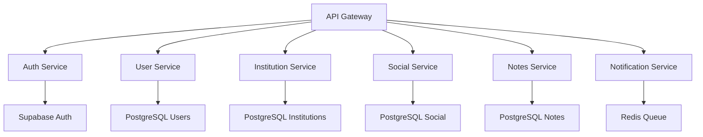

# 🏛️ Documentation d'Architecture - Plateforme HEdS (Final)
## Sections 15-18 : Métriques, Outils, Documentation et Roadmap

---

## 15. Métriques et Monitoring

### 15.1 Architecture de Monitoring

Le système de monitoring de la plateforme HEdS utilise une approche multi-couches pour surveiller les performances, la disponibilité et l'expérience utilisateur en temps réel.

**Stack de Monitoring :**
- **Application** : Sentry pour le tracking d'erreurs
- **Infrastructure** : Prometheus + Grafana
- **Logs** : ELK Stack (Elasticsearch, Logstash, Kibana)
- **Uptime** : UptimeRobot + StatusPage
- **Performance** : Google Lighthouse CI

### 15.2 Métriques de Performance

**Objectifs de Performance (SLA) :**
```yaml
# Objectifs de performance
performance_targets:
  lighthouse_scores:
    performance: ">= 90"
    accessibility: ">= 95"
    best_practices: ">= 90"
    seo: ">= 85"
  
  core_web_vitals:
    largest_contentful_paint: "< 2.5s"
    first_input_delay: "< 100ms"
    cumulative_layout_shift: "< 0.1"
  
  application_metrics:
    uptime: ">= 99.5%"
    response_time: "< 500ms"
    error_rate: "< 1%"
    
  database_metrics:
    query_time: "< 100ms"
    connection_pool: "< 80%"
    cache_hit_ratio: "> 90%"
```

### 15.3 Configuration Prometheus

```yaml
# prometheus.yml
global:
  scrape_interval: 15s
  evaluation_interval: 15s

rule_files:
  - "alert_rules.yml"

scrape_configs:
  - job_name: 'heds-frontend'
    static_configs:
      - targets: ['frontend:80']
    metrics_path: '/metrics'
    scrape_interval: 30s

  - job_name: 'heds-backend'
    static_configs:
      - targets: ['backend:3000']
    metrics_path: '/api/metrics'
    scrape_interval: 15s

  - job_name: 'postgres'
    static_configs:
      - targets: ['postgres-exporter:9187']

  - job_name: 'nginx'
    static_configs:
      - targets: ['nginx-exporter:9113']

alerting:
  alertmanagers:
    - static_configs:
        - targets:
          - alertmanager:9093
```

### 15.4 Dashboard Grafana

```json
{
  "dashboard": {
    "title": "HEdS Platform Monitoring",
    "panels": [
      {
        "title": "Response Time",
        "type": "graph",
        "targets": [
          {
            "expr": "histogram_quantile(0.95, rate(http_request_duration_seconds_bucket[5m]))",
            "legendFormat": "95th percentile"
          }
        ]
      },
      {
        "title": "Error Rate",
        "type": "singlestat",
        "targets": [
          {
            "expr": "rate(http_requests_total{status=~\"5..\"}[5m]) / rate(http_requests_total[5m]) * 100",
            "legendFormat": "Error Rate %"
          }
        ]
      },
      {
        "title": "Active Users",
        "type": "graph",
        "targets": [
          {
            "expr": "active_users_total",
            "legendFormat": "Active Users"
          }
        ]
      }
    ]
  }
}
```

### 15.5 Alerting et Notifications

```yaml
# alert_rules.yml
groups:
  - name: heds_alerts
    rules:
      - alert: HighErrorRate
        expr: rate(http_requests_total{status=~"5.."}[5m]) > 0.05
        for: 5m
        labels:
          severity: critical
        annotations:
          summary: "High error rate detected"
          description: "Error rate is {{ $value }} for the last 5 minutes"

      - alert: HighResponseTime
        expr: histogram_quantile(0.95, rate(http_request_duration_seconds_bucket[5m])) > 1
        for: 10m
        labels:
          severity: warning
        annotations:
          summary: "High response time"
          description: "95th percentile response time is {{ $value }}s"

      - alert: DatabaseConnectionHigh
        expr: postgres_connections_active / postgres_connections_max > 0.8
        for: 5m
        labels:
          severity: warning
        annotations:
          summary: "Database connection pool usage high"

      - alert: DiskSpaceHigh
        expr: (node_filesystem_size_bytes - node_filesystem_free_bytes) / node_filesystem_size_bytes > 0.85
        for: 10m
        labels:
          severity: critical
        annotations:
          summary: "Disk space usage critical"
```

### 15.6 Monitoring Frontend

```javascript
// utils/monitoring.js
export class MonitoringService {
  constructor() {
    this.startTime = performance.now()
    this.initPerformanceObserver()
    this.initErrorTracking()
  }

  // Core Web Vitals
  initPerformanceObserver() {
    // Largest Contentful Paint
    new PerformanceObserver((entryList) => {
      const entries = entryList.getEntries()
      const lastEntry = entries[entries.length - 1]
      this.reportMetric('LCP', lastEntry.startTime)
    }).observe({ entryTypes: ['largest-contentful-paint'] })

    // First Input Delay
    new PerformanceObserver((entryList) => {
      const firstInput = entryList.getEntries()[0]
      if (firstInput) {
        const delay = firstInput.processingStart - firstInput.startTime
        this.reportMetric('FID', delay)
      }
    }).observe({ entryTypes: ['first-input'] })

    // Cumulative Layout Shift
    let clsValue = 0
    new PerformanceObserver((entryList) => {
      for (const entry of entryList.getEntries()) {
        if (!entry.hadRecentInput) {
          clsValue += entry.value
        }
      }
      this.reportMetric('CLS', clsValue)
    }).observe({ entryTypes: ['layout-shift'] })
  }

  // Tracking des erreurs
  initErrorTracking() {
    window.addEventListener('error', (event) => {
      this.reportError({
        type: 'javascript',
        message: event.message,
        filename: event.filename,
        lineno: event.lineno,
        colno: event.colno,
        stack: event.error?.stack
      })
    })

    window.addEventListener('unhandledrejection', (event) => {
      this.reportError({
        type: 'promise',
        message: event.reason?.message || 'Unhandled Promise Rejection',
        stack: event.reason?.stack
      })
    })
  }

  // Métriques personnalisées
  trackUserAction(action, category = 'user_interaction') {
    this.reportMetric('user_action', 1, {
      action,
      category,
      timestamp: Date.now()
    })
  }

  trackPageLoad(route) {
    const loadTime = performance.now() - this.startTime
    this.reportMetric('page_load_time', loadTime, { route })
  }

  // Envoi des métriques
  reportMetric(name, value, labels = {}) {
    if (process.env.NODE_ENV === 'production') {
      fetch('/api/metrics', {
        method: 'POST',
        headers: { 'Content-Type': 'application/json' },
        body: JSON.stringify({
          metric: name,
          value,
          labels: {
            ...labels,
            user_agent: navigator.userAgent,
            timestamp: Date.now()
          }
        })
      }).catch(console.error)
    }
  }

  reportError(error) {
    if (process.env.NODE_ENV === 'production') {
      fetch('/api/errors', {
        method: 'POST',
        headers: { 'Content-Type': 'application/json' },
        body: JSON.stringify({
          ...error,
          url: window.location.href,
          user_agent: navigator.userAgent,
          timestamp: Date.now()
        })
      }).catch(console.error)
    }
  }
}

export const monitoring = new MonitoringService()
```

---

## 16. Outils de Développement

### 16.1 Environnement de Développement

**IDE et Extensions Recommandées :**
```json
{
  "recommendations": [
    "vue.volar",
    "vue.vscode-typescript-vue-plugin",
    "bradlc.vscode-tailwindcss",
    "esbenp.prettier-vscode",
    "dbaeumer.vscode-eslint",
    "ms-vscode.vscode-typescript-next",
    "formulahendry.auto-rename-tag",
    "christian-kohler.path-intellisense"
  ]
}
```

**Configuration VSCode :**
```json
{
  "editor.formatOnSave": true,
  "editor.defaultFormatter": "esbenp.prettier-vscode",
  "editor.codeActionsOnSave": {
    "source.fixAll.eslint": true
  },
  "typescript.preferences.importModuleSpecifier": "relative",
  "vue.codeActions.enabled": true,
  "vue.complete.casing.tags": "kebab",
  "vue.complete.casing.props": "camel"
}
```

### 16.2 Qualité de Code

**Configuration ESLint :**
```javascript
// .eslintrc.js
module.exports = {
  root: true,
  env: {
    node: true,
    browser: true,
    es2022: true
  },
  extends: [
    'plugin:vue/vue3-essential',
    'eslint:recommended',
    '@vue/eslint-config-prettier'
  ],
  parserOptions: {
    ecmaVersion: 'latest',
    sourceType: 'module'
  },
  rules: {
    'no-console': process.env.NODE_ENV === 'production' ? 'warn' : 'off',
    'no-debugger': process.env.NODE_ENV === 'production' ? 'warn' : 'off',
    'vue/multi-word-component-names': 'off',
    'vue/no-unused-vars': 'error',
    'prefer-const': 'error',
    'no-var': 'error'
  },
  overrides: [
    {
      files: ['**/*.vue'],
      rules: {
        'vue/component-name-in-template-casing': ['error', 'PascalCase']
      }
    }
  ]
}
```

**Configuration Prettier :**
```json
{
  "semi": false,
  "singleQuote": true,
  "tabWidth": 2,
  "trailingComma": "none",
  "printWidth": 100,
  "bracketSpacing": true,
  "arrowParens": "avoid",
  "vueIndentScriptAndStyle": false
}
```

### 16.3 Git Hooks et Conventions

**Configuration Husky :**
```json
{
  "husky": {
    "hooks": {
      "pre-commit": "lint-staged",
      "commit-msg": "commitlint -E HUSKY_GIT_PARAMS",
      "pre-push": "npm run test"
    }
  }
}
```

**Lint-staged :**
```json
{
  "lint-staged": {
    "*.{js,vue}": [
      "eslint --fix",
      "prettier --write"
    ],
    "*.{css,scss,vue}": [
      "stylelint --fix",
      "prettier --write"
    ],
    "*.md": [
      "prettier --write"
    ]
  }
}
```

**Commitizen Configuration :**
```json
{
  "config": {
    "commitizen": {
      "path": "cz-conventional-changelog"
    }
  }
}
```

### 16.4 Tests et Validation

**Configuration Vitest :**
```javascript
// vitest.config.js
import { defineConfig } from 'vitest/config'
import vue from '@vitejs/plugin-vue'

export default defineConfig({
  plugins: [vue()],
  test: {
    globals: true,
    environment: 'jsdom',
    setupFiles: ['./tests/setup.js'],
    coverage: {
      provider: 'c8',
      reporter: ['text', 'json', 'html'],
      exclude: [
        'node_modules/',
        'tests/',
        '**/*.d.ts'
      ]
    }
  },
  resolve: {
    alias: {
      '@': '/src'
    }
  }
})
```

**Exemple de Test :**
```javascript
// tests/components/LoginForm.test.js
import { describe, it, expect, vi } from 'vitest'
import { mount } from '@vue/test-utils'
import { createPinia } from 'pinia'
import LoginForm from '@/components/auth/LoginForm.vue'

describe('LoginForm', () => {
  it('should render login form', () => {
    const wrapper = mount(LoginForm, {
      global: {
        plugins: [createPinia()]
      }
    })
    
    expect(wrapper.find('input[type="email"]').exists()).toBe(true)
    expect(wrapper.find('input[type="password"]').exists()).toBe(true)
    expect(wrapper.find('button[type="submit"]').exists()).toBe(true)
  })

  it('should validate email format', async () => {
    const wrapper = mount(LoginForm, {
      global: {
        plugins: [createPinia()]
      }
    })
    
    const emailInput = wrapper.find('input[type="email"]')
    await emailInput.setValue('invalid-email')
    await emailInput.trigger('blur')
    
    expect(wrapper.text()).toContain('Email invalide')
  })

  it('should emit login event on form submit', async () => {
    const wrapper = mount(LoginForm, {
      global: {
        plugins: [createPinia()]
      }
    })
    
    await wrapper.find('input[type="email"]').setValue('test@hevs.ch')
    await wrapper.find('input[type="password"]').setValue('password123')
    await wrapper.find('form').trigger('submit')
    
    expect(wrapper.emitted('login')).toBeTruthy()
  })
})
```

---

## 17. Documentation Technique

### 17.1 Standards de Documentation

**Structure de Documentation :**
```
docs/
├── README.md                    # Vue d'ensemble du projet
├── ARCHITECTURE.md              # Architecture technique
├── DEPLOYMENT.md                # Guide de déploiement
├── DEVELOPMENT.md               # Guide de développement
├── API.md                       # Documentation API
├── CONTRIBUTING.md              # Guide de contribution
├── CHANGELOG.md                 # Journal des modifications
├── components/                  # Documentation des composants
│   ├── README.md
│   ├── auth/
│   ├── admin/
│   └── social/
├── services/                    # Documentation des services
│   ├── README.md
│   ├── authService.md
│   └── databaseService.md
└── guides/                      # Guides utilisateur
    ├── student-guide.md
    ├── teacher-guide.md
    └── admin-guide.md
```

### 17.2 Documentation des Composants

**Template de Documentation Composant :**
```markdown
# ComponentName

## Description
Brève description du composant et de son utilisation.

## Props
| Nom | Type | Défaut | Description |
|-----|------|--------|-------------|
| prop1 | String | '' | Description de prop1 |
| prop2 | Boolean | false | Description de prop2 |

## Events
| Nom | Payload | Description |
|-----|---------|-------------|
| event1 | Object | Description de l'événement |

## Slots
| Nom | Description |
|-----|-------------|
| default | Contenu par défaut |
| header | En-tête personnalisé |

## Exemple d'utilisation
```vue
<template>
  <ComponentName
    :prop1="value1"
    :prop2="true"
    @event1="handleEvent"
  >
    <template #header>
      <h2>Titre personnalisé</h2>
    </template>
    Contenu par défaut
  </ComponentName>
</template>
```

## Tests
- [ ] Rendu correct avec props par défaut
- [ ] Émission des événements
- [ ] Validation des props
```

### 17.3 Documentation API

**Format OpenAPI/Swagger :**
```yaml
# api-docs.yml
openapi: 3.0.0
info:
  title: HEdS Platform API
  version: 1.0.0
  description: API pour la plateforme éducative HEdS

servers:
  - url: https://hedsvs.ch/api
    description: Production server
  - url: http://localhost:3000/api
    description: Development server

paths:
  /auth/login:
    post:
      summary: Authentification utilisateur
      tags:
        - Authentication
      requestBody:
        required: true
        content:
          application/json:
            schema:
              type: object
              properties:
                email:
                  type: string
                  format: email
                password:
                  type: string
                  minLength: 8
      responses:
        '200':
          description: Connexion réussie
          content:
            application/json:
              schema:
                type: object
                properties:
                  token:
                    type: string
                  user:
                    $ref: '#/components/schemas/User'
        '401':
          description: Identifiants invalides

components:
  schemas:
    User:
      type: object
      properties:
        id:
          type: string
          format: uuid
        email:
          type: string
          format: email
        displayName:
          type: string
        role:
          type: string
          enum: [student, teacher, practitioner, admin]
```

### 17.4 Guides Utilisateur

**Structure Guide Étudiant :**
```markdown
# Guide Étudiant - Plateforme HEdS

## 1. Premiers Pas
### Connexion à la plateforme
### Navigation dans l'interface
### Personnalisation du profil

## 2. Gestion des Stages
### Recherche de places de stage
### Candidature en ligne
### Suivi des candidatures

## 3. Réseau Social
### Création de posts
### Interaction avec la communauté
### Partage d'expériences

## 4. Système de Notes
### Création de classeurs
### Prise de notes avec TipTap
### Partage et collaboration

## 5. Applications Intégrées
### Calendrier académique
### Messagerie interne
### Outils de productivité

## 6. Support et Aide
### FAQ
### Contact support
### Signalement de problèmes
```

---

## 18. Roadmap et Prochaines Étapes

### 18.1 Roadmap Technique 2024-2025

**Q1 2024 - Consolidation (Terminé) ✅**
- ✅ Architecture de base Vue.js 3 + Firebase
- ✅ Interface d'administration complète
- ✅ Système d'authentification et de rôles
- ✅ Réseau social éducatif fonctionnel
- ✅ Système de notes avec TipTap
- ✅ Cartographie des institutions
- ✅ Applications intégrées (calendrier, chat, tâches)

**Q2 2024 - Migration et Optimisation (En cours) 🔄**
- 🔄 Migration Firebase vers Supabase
- 🔄 Déploiement VPS avec Docker
- 🔄 Mise en place CI/CD GitHub Actions
- 🔄 Optimisation des performances
- 🔄 Tests automatisés complets
- 🔄 Monitoring et alerting

**Q3 2024 - Fonctionnalités Avancées 📋**
- 📋 Application mobile native (Capacitor + Ionic)
- 📋 Notifications push temps réel
- 📋 Système de gamification avancé
- 📋 IA pour recommandations de stages
- 📋 Intégration vidéoconférence
- 📋 Module d'évaluation en ligne

**Q4 2024 - Intelligence et Analytics 📋**
- 📋 Dashboard analytics avancé
- 📋 Machine Learning pour matching stages
- 📋 Chatbot IA pour support
- 📋 Système de recommandations personnalisées
- 📋 Analyse prédictive des performances
- 📋 Intégration APIs externes (SwissUni, etc.)

### 18.2 Évolutions Technologiques

**Architecture Microservices (2025)**


**Stack Technologique Future :**
- **Frontend** : Vue.js 3 + Nuxt.js (SSR)
- **Backend** : Node.js + Fastify (Microservices)
- **Database** : PostgreSQL + Redis
- **Search** : Elasticsearch
- **Queue** : Redis Bull
- **Monitoring** : Prometheus + Grafana
- **Deployment** : Kubernetes

### 18.3 Fonctionnalités Innovantes

**Intelligence Artificielle :**
- **Recommandations** : ML pour matching étudiants-stages
- **Assistance** : Chatbot IA pour support 24/7
- **Analyse** : Prédiction de réussite des stages
- **Contenu** : Génération automatique de résumés

**Réalité Augmentée/Virtuelle :**
- **Formation** : Simulations 3D d'exercices
- **Anatomie** : Visualisation AR du corps humain
- **Stages** : Visite virtuelle des institutions
- **Collaboration** : Espaces virtuels partagés

**Blockchain et Web3 :**
- **Certifications** : Diplômes vérifiables blockchain
- **Portfolio** : NFT des réalisations étudiantes
- **Réputation** : Système de réputation décentralisé
- **Paiements** : Crypto pour frais de formation

### 18.4 Expansion Géographique

**Phase 1 : Suisse Romande (2024)**
- HES-SO Valais (actuel)
- HES-SO Genève
- HES-SO Vaud
- HES-SO Fribourg

**Phase 2 : Suisse Alémanique (2025)**
- ZHAW Winterthur
- BFH Berne
- OST Saint-Gall

**Phase 3 : International (2026)**
- Universités européennes partenaires
- Programmes d'échange Erasmus+
- Institutions francophones

### 18.5 Métriques de Succès

**Objectifs 2024 :**
- 👥 **Utilisateurs actifs** : 2000+ étudiants, 200+ enseignants
- 📊 **Engagement** : 70% d'utilisation hebdomadaire
- 🏥 **Institutions** : 50+ partenaires actifs
- ⭐ **Satisfaction** : 4.5/5 étoiles utilisateurs
- 🚀 **Performance** : 99.5% uptime, <2s temps de réponse

**Objectifs 2025 :**
- 👥 **Utilisateurs actifs** : 5000+ utilisateurs
- 🌍 **Couverture** : Toute la Suisse
- 📱 **Mobile** : 80% d'utilisation mobile
- 🤖 **IA** : 90% de précision recommandations
- 💰 **ROI** : Réduction 30% coûts administratifs

### 18.6 Défis et Risques

**Défis Techniques :**
- **Scalabilité** : Gestion de la croissance utilisateurs
- **Performance** : Maintien des temps de réponse
- **Sécurité** : Protection des données sensibles
- **Intégration** : Compatibilité systèmes existants

**Défis Organisationnels :**
- **Adoption** : Formation des utilisateurs
- **Gouvernance** : Coordination multi-institutions
- **Budget** : Financement développements futurs
- **Réglementation** : Conformité RGPD et LPD

**Plan de Mitigation :**
- Tests de charge réguliers
- Audits de sécurité trimestriels
- Formation continue équipes
- Veille technologique permanente
- Backup et disaster recovery

---

## Conclusion

La plateforme HEdS représente une solution technologique moderne et évolutive pour la digitalisation de la formation en physiothérapie. L'architecture actuelle, basée sur Vue.js 3 et Firebase, offre une base solide pour les développements futurs.

La migration planifiée vers Supabase et le déploiement sur VPS Infomaniak permettront d'améliorer les performances, de réduire les coûts et d'augmenter la flexibilité technique. L'implémentation du CI/CD avec GitHub Actions garantira une qualité de code élevée et des déploiements fiables.

Les prochaines étapes incluent l'expansion des fonctionnalités, l'intégration d'intelligence artificielle, et le développement d'une application mobile native. Cette roadmap ambitieuse positionne la plateforme HEdS comme un leader dans l'innovation pédagogique numérique.

---

*Documentation technique académique complète*  
*Version 1.0 - 30 janvier 2025*  
*Plateforme HEdS - Haute École de Santé du Valais*
