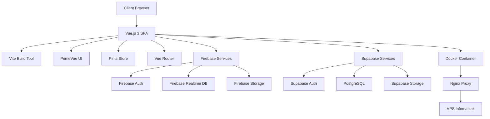

# 🏛️ Documentation d'Architecture - Plateforme HEdS
## Architecture Logicielle et Déploiement d'une Application Web Éducative

---

## 📋 Table des Matières

1. [Introduction et Contexte](#1-introduction-et-contexte)
2. [Architecture Technique](#2-architecture-technique)
3. [Structure du Projet](#3-structure-du-projet)
4. [Services et API](#4-services-et-api)
5. [Gestion d'État (State Management)](#5-gestion-détat-state-management)
6. [Routing et Navigation](#6-routing-et-navigation)
7. [Guards de Navigation et Sécurité](#7-guards-de-navigation-et-sécurité)
8. [Authentification et Sécurité](#8-authentification-et-sécurité)
9. [Base de Données](#9-base-de-données)
10. [Migration Firebase vers Supabase](#10-migration-firebase-vers-supabase)
11. [Configuration Vite et Build](#11-configuration-vite-et-build)
12. [Déploiement et Infrastructure](#12-déploiement-et-infrastructure)
13. [CI/CD avec GitHub Actions](#13-cicd-avec-github-actions)
14. [Stockage et Gestion des Médias](#14-stockage-et-gestion-des-médias)
15. [Métriques et Monitoring](#15-métriques-et-monitoring)
16. [Outils de Développement](#16-outils-de-développement)
17. [Documentation Technique](#17-documentation-technique)
18. [Roadmap et Prochaines Étapes](#18-roadmap-et-prochaines-étapes)

---

## 1. Introduction et Contexte

### 1.1 Présentation du Projet

La **Plateforme HEdS** (Haute École de Santé du Valais) est une application web moderne conçue pour digitaliser et optimiser la gestion des formations pratiques en physiothérapie. Cette plateforme constitue un écosystème numérique complet intégrant des fonctionnalités de réseau social éducatif, de gestion administrative, et d'outils pédagogiques innovants.

### 1.2 Objectifs Stratégiques

**Objectifs Pédagogiques :**
- 📚 Centralisation de la gestion des Pratiques de Formation Professionnelle (PFP)
- 🏥 Cartographie interactive des institutions partenaires et places de stage
- 📝 Système de documentation et de notes collaboratives
- 🎮 Gamification de l'apprentissage avec des mécaniques de jeu 3D

**Objectifs Techniques :**
- 👥 Réseau social éducatif favorisant les échanges entre étudiants, enseignants et praticiens
- 📊 Interface d'administration complète pour la gestion institutionnelle
- 📱 Application Progressive Web App (PWA) avec support mobile natif
- 🔒 Système d'authentification et d'autorisation granulaire

### 1.3 Public Cible

- **Étudiants en physiothérapie** : Accès aux stages, réseau social, outils d'apprentissage
- **Enseignants** : Suivi pédagogique, évaluation, gestion des contenus
- **Praticiens formateurs** : Encadrement des stagiaires, évaluation pratique
- **Administrateurs** : Gestion institutionnelle, statistiques, validation des processus

---

## 2. Architecture Technique

### 2.1 Vue d'Ensemble Architecturale

L'architecture de la plateforme suit un modèle **Single Page Application (SPA)** moderne basé sur une approche **JAMstack** (JavaScript, APIs, Markup) avec une séparation claire entre le frontend et les services backend.



### 2.2 Stack Frontend

**Framework Principal :**
- **Vue.js 3** (v3.4+) avec Composition API
  - Réactivité optimisée avec Proxy
  - Support TypeScript natif
  - Performance améliorée avec le Virtual DOM optimisé
  - Écosystème riche et communauté active

**Outils de Build et Développement :**
- **Vite.js** (v5+) : Build tool ultra-rapide
  - Hot Module Replacement (HMR) instantané
  - Tree-shaking automatique
  - Support ESM natif
  - Optimisation des bundles en production

**Interface Utilisateur :**
- **PrimeVue** (v4+) : Bibliothèque de composants UI
  - Plus de 90 composants prêts à l'emploi
  - Thèmes personnalisables
  - Accessibilité WCAG 2.1 AA
  - Support responsive natif

**Gestion d'État :**
- **Pinia** : Store pattern officiel pour Vue.js
  - API intuitive et type-safe
  - DevTools intégrés
  - Support SSR
  - Modularité et composition

**Routing :**
- **Vue Router 4** : Routing officiel Vue.js
  - Lazy loading des routes
  - Guards de navigation
  - Support des nested routes
  - History mode avec fallback

**Progressive Web App :**
- **Workbox** : Service Worker et mise en cache
- **Capacitor** : Wrapper natif mobile
- **Ionic** : Composants UI mobile (intégration future)

### 2.3 Stack Backend et Services

**Services d'Authentification :**
- **Firebase Auth** (actuel) : Authentification multi-provider
- **Supabase Auth** (migration) : Authentification PostgreSQL-based

**Base de Données :**
- **Firebase Realtime Database** (actuel) : Base NoSQL temps réel
- **Supabase PostgreSQL** (migration) : Base relationnelle avec Row Level Security

**Stockage de Fichiers :**
- **Firebase Storage** (actuel) : Stockage cloud avec CDN
- **Supabase Storage** (migration) : Stockage S3-compatible
- **VPS Storage** (option) : Stockage local avec optimisation

**Hébergement et Infrastructure :**
- **VPS Infomaniak** : Serveur privé virtuel (https://hedsvs.ch)
- **Docker** : Containerisation de l'application
- **Nginx** : Reverse proxy et serveur web
- **Let's Encrypt** : Certificats SSL automatiques

### 2.4 Technologies Complémentaires

**Outils de Développement :**
- **Git** : Contrôle de version distribué
- **GitHub** : Hébergement de code et collaboration
- **Docker** : Containerisation et déploiement
- **ESLint** : Linting JavaScript/Vue
- **Prettier** : Formatage automatique du code

**Bibliothèques Spécialisées :**
- **Leaflet.js** : Cartographie interactive
- **TipTap** : Éditeur de texte riche WYSIWYG
- **Chart.js** : Visualisation de données
- **FullCalendar** : Gestion de calendriers
- **Three.js** : Rendu 3D pour les jeux
- **ElevenLabs** : Synthèse vocale IA

**Outils de Qualité :**
- **Husky** : Git hooks automatiques
- **Commitizen** : Standardisation des commits
- **Lighthouse** : Audit de performance
- **Vue DevTools** : Debugging Vue.js

---

## 3. Structure du Projet

### 3.1 Organisation Générale

La structure du projet suit les meilleures pratiques de développement Vue.js avec une séparation claire des responsabilités et une organisation modulaire facilitant la maintenance et l'évolutivité.

```
pfpheds/
├── 📁 public/                    # Assets statiques servis directement
│   ├── assets/images/           # Images publiques (logos, icônes)
│   ├── manifest.json           # Manifest PWA
│   ├── sw.js                   # Service Worker personnalisé
│   └── robots.txt              # Configuration SEO
├── 📁 src/                      # Code source principal
│   ├── 📁 assets/              # Ressources dynamiques
│   │   ├── images/            # Images, logos, icônes
│   │   ├── styles/            # Styles globaux SCSS
│   │   └── icons/             # Icônes SVG
│   ├── 📁 components/         # Composants Vue réutilisables
│   │   ├── admin/             # Interface d'administration
│   │   ├── common/            # Composants transversaux
│   │   ├── editor/            # Éditeurs de contenu
│   │   ├── social/            # Fonctionnalités sociales
│   │   ├── ui/                # Composants UI génériques
│   │   └── user/              # Gestion utilisateurs
│   ├── 📁 views/              # Pages/Vues principales
│   │   ├── admin/             # Vues d'administration
│   │   ├── apps/              # Applications intégrées
│   │   ├── auth/              # Authentification
│   │   ├── home/              # Pages d'accueil
│   │   ├── institutions/      # Gestion institutions
│   │   ├── social/            # Réseau social
│   │   └── users/             # Profils utilisateurs
│   ├── 📁 stores/             # Stores Pinia (gestion d'état)
│   ├── 📁 services/           # Services API et logique métier
│   ├── 📁 hooks/              # Composables Vue
│   ├── 📁 utils/              # Utilitaires et helpers
│   ├── 📁 config/             # Configuration de l'application
│   ├── App.vue                # Composant racine
│   ├── main.js                # Point d'entrée de l'application
│   └── router.js              # Configuration du routing
├── 📁 backend/                # Backend Node.js (optionnel)
├── 📁 nginx/                  # Configuration Nginx
├── 📁 docker/                 # Fichiers Docker
├── firebase.js                # Configuration Firebase
├── vite.config.js            # Configuration Vite
├── docker-compose.yml        # Orchestration Docker
└── package.json              # Dépendances et scripts
```

### 3.2 Principes d'Organisation

**Séparation des Responsabilités :**
- **Views** : Pages complètes avec logique de présentation
- **Components** : Éléments réutilisables et modulaires
- **Services** : Logique métier et communication API
- **Stores** : Gestion d'état centralisée
- **Utils** : Fonctions utilitaires pures

**Modularité :**
- Organisation par domaine fonctionnel (admin, social, editor)
- Composants atomiques et composables
- Services spécialisés par contexte métier

---

## 4. Services et API

### 4.1 Architecture des Services

Les services constituent la couche d'abstraction entre l'interface utilisateur et les APIs externes. Ils encapsulent la logique métier et fournissent une interface cohérente pour l'accès aux données.

```javascript
// Structure des services
services/
├── authService.js          # Authentification et autorisation
├── databaseService.js      # Opérations base de données
├── storageService.js       # Gestion des fichiers
├── notesService.js         # Système de notes
├── institutionService.js   # Gestion des institutions
├── userService.js          # Profils utilisateurs
├── postService.js          # Réseau social
├── gameService.js          # Gamification
└── notificationService.js  # Notifications
```

### 4.2 Exemple d'Implémentation Service

```javascript
// services/notesService.js
import { db } from '@/config/firebase'
import { ref, push, set, get, remove, onValue } from 'firebase/database'

export class NotesService {
  /**
   * Créer un nouveau classeur de notes
   * @param {string} userId - ID de l'utilisateur
   * @param {Object} notebookData - Données du classeur
   * @returns {Promise<string>} ID du classeur créé
   */
  async createNotebook(userId, notebookData) {
    try {
      const notebooksRef = ref(db, `notes/${userId}/notebooks`)
      const newNotebookRef = push(notebooksRef)
      
      await set(newNotebookRef, {
        ...notebookData,
        createdAt: Date.now(),
        updatedAt: Date.now(),
        version: '1.0'
      })
      
      return newNotebookRef.key
    } catch (error) {
      console.error('Erreur création classeur:', error)
      throw new Error('Impossible de créer le classeur')
    }
  }

  /**
   * Récupérer les classeurs d'un utilisateur
   * @param {string} userId - ID de l'utilisateur
   * @returns {Promise<Object>} Classeurs de l'utilisateur
   */
  async getNotebooks(userId) {
    try {
      const notebooksRef = ref(db, `notes/${userId}/notebooks`)
      const snapshot = await get(notebooksRef)
      return snapshot.val() || {}
    } catch (error) {
      console.error('Erreur récupération classeurs:', error)
      return {}
    }
  }

  /**
   * Écouter les changements en temps réel
   * @param {string} userId - ID de l'utilisateur
   * @param {Function} callback - Fonction de callback
   * @returns {Function} Fonction de désabonnement
   */
  subscribeToNotebooks(userId, callback) {
    const notebooksRef = ref(db, `notes/${userId}/notebooks`)
    return onValue(notebooksRef, (snapshot) => {
      callback(snapshot.val() || {})
    })
  }
}

export const notesService = new NotesService()
```

### 4.3 Gestion des Erreurs et Retry

```javascript
// utils/apiUtils.js
export class ApiError extends Error {
  constructor(message, code, details = {}) {
    super(message)
    this.name = 'ApiError'
    this.code = code
    this.details = details
  }
}

export async function withRetry(fn, maxRetries = 3, delay = 1000) {
  for (let i = 0; i < maxRetries; i++) {
    try {
      return await fn()
    } catch (error) {
      if (i === maxRetries - 1) throw error
      await new Promise(resolve => setTimeout(resolve, delay * Math.pow(2, i)))
    }
  }
}
```

---

## 5. Gestion d'État (State Management)

### 5.1 Architecture Pinia

Pinia est utilisé comme solution de gestion d'état centralisée, offrant une API moderne et type-safe pour Vue.js 3. L'architecture suit le pattern de stores modulaires avec une séparation claire des responsabilités.

```javascript
// Structure des stores
stores/
├── auth.js                 # Authentification et session
├── user.js                 # Données utilisateur
├── app.js                  # État global de l'application
├── notes.js                # Système de notes
├── social.js               # Réseau social
├── institutions.js         # Gestion des institutions
└── notifications.js        # Notifications
```

### 5.2 Store d'Authentification

```javascript
// stores/auth.js
import { defineStore } from 'pinia'
import { ref, computed } from 'vue'
import { authService } from '@/services/authService'

export const useAuthStore = defineStore('auth', () => {
  // État réactif
  const user = ref(null)
  const loading = ref(false)
  const error = ref(null)
  const sessionExpiry = ref(null)

  // Getters calculés
  const isAuthenticated = computed(() => !!user.value)
  const isAdmin = computed(() => user.value?.role === 'admin')
  const isTeacher = computed(() => user.value?.role === 'teacher')
  const hasRole = computed(() => (role) => user.value?.roles?.includes(role))

  // Actions
  const login = async (credentials) => {
    loading.value = true
    error.value = null
    
    try {
      const result = await authService.signIn(credentials)
      user.value = result.user
      sessionExpiry.value = result.expiresAt
      
      // Démarrer le refresh automatique du token
      startTokenRefresh()
      
      return result
    } catch (error) {
      error.value = error.message
      throw error
    } finally {
      loading.value = false
    }
  }

  const logout = async () => {
    try {
      await authService.signOut()
      user.value = null
      sessionExpiry.value = null
      stopTokenRefresh()
    } catch (err) {
      console.error('Erreur lors de la déconnexion:', err)
    }
  }

  const refreshToken = async () => {
    try {
      const result = await authService.refreshToken()
      sessionExpiry.value = result.expiresAt
    } catch (err) {
      console.error('Erreur refresh token:', err)
      await logout()
    }
  }

  // Gestion automatique du refresh token
  let refreshInterval = null
  
  const startTokenRefresh = () => {
    if (refreshInterval) clearInterval(refreshInterval)
    
    refreshInterval = setInterval(() => {
      const now = Date.now()
      const expiry = sessionExpiry.value
      
      // Refresh 5 minutes avant expiration
      if (expiry && (expiry - now) < 5 * 60 * 1000) {
        refreshToken()
      }
    }, 60000) // Vérifier chaque minute
  }

  const stopTokenRefresh = () => {
    if (refreshInterval) {
      clearInterval(refreshInterval)
      refreshInterval = null
    }
  }

  return {
    // État
    user,
    loading,
    error,
    sessionExpiry,
    
    // Getters
    isAuthenticated,
    isAdmin,
    isTeacher,
    hasRole,
    
    // Actions
    login,
    logout,
    refreshToken
  }
})
```

### 5.3 Store de Gestion des Notes

```javascript
// stores/notes.js
import { defineStore } from 'pinia'
import { ref, computed } from 'vue'
import { notesService } from '@/services/notesService'
import { useAuthStore } from './auth'

export const useNotesStore = defineStore('notes', () => {
  const authStore = useAuthStore()
  
  // État
  const notebooks = ref({})
  const currentNotebook = ref(null)
  const currentPage = ref(null)
  const loading = ref(false)
  const syncing = ref(false)

  // Getters
  const notebooksList = computed(() => Object.values(notebooks.value))
  const currentPages = computed(() => {
    if (!currentNotebook.value) return []
    return Object.values(currentNotebook.value.pages || {})
  })

  // Actions
  const loadNotebooks = async () => {
    if (!authStore.user) return
    
    loading.value = true
    try {
      const data = await notesService.getNotebooks(authStore.user.uid)
      notebooks.value = data
    } catch (error) {
      console.error('Erreur chargement classeurs:', error)
    } finally {
      loading.value = false
    }
  }

  const createNotebook = async (notebookData) => {
    if (!authStore.user) throw new Error('Utilisateur non connecté')
    
    try {
      const notebookId = await notesService.createNotebook(
        authStore.user.uid, 
        notebookData
      )
      
      // Mettre à jour le store local
      notebooks.value[notebookId] = {
        id: notebookId,
        ...notebookData,
        pages: {}
      }
      
      return notebookId
    } catch (error) {
      console.error('Erreur création classeur:', error)
      throw error
    }
  }

  const savePageContent = async (pageId, content) => {
    if (!currentNotebook.value || !authStore.user) return
    
    syncing.value = true
    try {
      await notesService.updatePageContent(
        authStore.user.uid,
        currentNotebook.value.id,
        pageId,
        content
      )
      
      // Mettre à jour le store local
      if (currentNotebook.value.pages[pageId]) {
        currentNotebook.value.pages[pageId].content = content
        currentNotebook.value.pages[pageId].updatedAt = Date.now()
      }
    } catch (error) {
      console.error('Erreur sauvegarde page:', error)
    } finally {
      syncing.value = false
    }
  }

  return {
    // État
    notebooks,
    currentNotebook,
    currentPage,
    loading,
    syncing,
    
    // Getters
    notebooksList,
    currentPages,
    
    // Actions
    loadNotebooks,
    createNotebook,
    savePageContent
  }
})
```

---

## 6. Routing et Navigation

### 6.1 Configuration du Router

Le système de routing utilise Vue Router 4 avec une configuration modulaire supportant le lazy loading, les nested routes et les meta-données pour la sécurité.

```javascript
// router.js
import { createRouter, createWebHistory } from 'vue-router'
import { useAuthStore } from '@/stores/auth'

// Lazy loading des composants
const HomeView = () => import('@/views/home/HomeView.vue')
const LoginView = () => import('@/views/auth/LoginView.vue')
const DashboardView = () => import('@/views/dashboard/DashboardView.vue')

const routes = [
  // Routes publiques
  {
    path: '/',
    name: 'Home',
    component: HomeView,
    meta: {
      title: 'Accueil - HEdS',
      description: 'Plateforme éducative HEdS'
    }
  },
  
  // Authentification
  {
    path: '/auth',
    component: () => import('@/views/auth/AuthLayout.vue'),
    children: [
      {
        path: 'login',
        name: 'Login',
        component: LoginView,
        meta: { 
          title: 'Connexion',
          requiresGuest: true 
        }
      },
      {
        path: 'register',
        name: 'Register',
        component: () => import('@/views/auth/RegisterView.vue'),
        meta: { 
          title: 'Inscription',
          requiresGuest: true 
        }
      }
    ]
  },
  
  // Routes protégées
  {
    path: '/dashboard',
    name: 'Dashboard',
    component: DashboardView,
    meta: {
      title: 'Tableau de bord',
      requiresAuth: true
    }
  },
  
  // Administration
  {
    path: '/admin',
    component: () => import('@/views/admin/AdminLayout.vue'),
    meta: {
      requiresAuth: true,
      requiresRole: ['admin', 'super_admin']
    },
    children: [
      {
        path: '',
        name: 'AdminDashboard',
        component: () => import('@/views/admin/AdminDashboardView.vue'),
        meta: { title: 'Administration' }
      },
      {
        path: 'users',
        name: 'AdminUsers',
        component: () => import('@/views/admin/users/UserListView.vue'),
        meta: { title: 'Gestion des utilisateurs' }
      },
      {
        path: 'institutions',
        name: 'AdminInstitutions',
        component: () => import('@/views/admin/institutions/InstitutionListView.vue'),
        meta: { title: 'Gestion des institutions' }
      }
    ]
  },
  
  // Applications intégrées
  {
    path: '/apps',
    component: () => import('@/views/apps/AppsLayout.vue'),
    meta: { requiresAuth: true },
    children: [
      {
        path: 'notes',
        name: 'Notes',
        component: () => import('@/views/apps/notes/NotesWorkspaceView.vue'),
        meta: { title: 'Mes Notes' }
      },
      {
        path: 'social',
        name: 'Social',
        component: () => import('@/views/apps/social/SocialView.vue'),
        meta: { title: 'Réseau Social' }
      },
      {
        path: 'calendar',
        name: 'Calendar',
        component: () => import('@/views/apps/calendar/CalendarView.vue'),
        meta: { title: 'Calendrier' }
      }
    ]
  },
  
  // Gestion d'erreurs
  {
    path: '/404',
    name: 'NotFound',
    component: () => import('@/views/error/NotFoundView.vue'),
    meta: { title: 'Page non trouvée' }
  },
  {
    path: '/:pathMatch(.*)*',
    redirect: '/404'
  }
]

const router = createRouter({
  history: createWebHistory(),
  routes,
  scrollBehavior(to, from, savedPosition) {
    if (savedPosition) {
      return savedPosition
    } else {
      return { top: 0 }
    }
  }
})

export default router
```

---

## 7. Guards de Navigation et Sécurité

### 7.1 Guards d'Authentification

Les guards de navigation assurent la sécurité de l'application en contrôlant l'accès aux routes selon l'état d'authentification et les rôles utilisateur.

```javascript
// router/guards.js
import { useAuthStore } from '@/stores/auth'
import { useToast } from 'primevue/usetoast'

export function setupRouterGuards(router) {
  const toast = useToast()

  // Guard principal d'authentification
  router.beforeEach(async (to, from, next) => {
    const authStore = useAuthStore()
    
    // Vérifier l'état d'authentification
    if (!authStore.user && localStorage.getItem('auth_token')) {
      try {
        await authStore.refreshToken()
      } catch (error) {
        console.error('Erreur refresh token:', error)
        localStorage.removeItem('auth_token')
      }
    }

    // Routes nécessitant une authentification
    if (to.meta.requiresAuth && !authStore.isAuthenticated) {
      toast.add({
        severity: 'warn',
        summary: 'Accès restreint',
        detail: 'Vous devez être connecté pour accéder à cette page',
        life: 3000
      })
      
      next({
        name: 'Login',
        query: { redirect: to.fullPath }
      })
      return
    }

    // Routes pour invités uniquement (login, register)
    if (to.meta.requiresGuest && authStore.isAuthenticated) {
      next({ name: 'Dashboard' })
      return
    }

    // Vérification des rôles
    if (to.meta.requiresRole) {
      const requiredRoles = Array.isArray(to.meta.requiresRole) 
        ? to.meta.requiresRole 
        : [to.meta.requiresRole]
      
      const hasRequiredRole = requiredRoles.some(role => 
        authStore.hasRole(role)
      )

      if (!hasRequiredRole) {
        toast.add({
          severity: 'error',
          summary: 'Accès refusé',
          detail: 'Vous n\'avez pas les permissions nécessaires',
          life: 3000
        })
        
        next({ name: 'Dashboard' })
        return
      }
    }

    next()
  })

  // Mise à jour du titre de la page
  router.afterEach((to) => {
    document.title = to.meta.title 
      ? `${to.meta.title} - HEdS` 
      : 'Plateforme HEdS'
    
    // Mise à jour des meta tags
    if (to.meta.description) {
      const metaDescription = document.querySelector('meta[name="description"]')
      if (metaDescription) {
        metaDescription.setAttribute('content', to.meta.description)
      }
    }
  })
}
```

### 7.2 Middleware de Sécurité

```javascript
// middleware/security.js
export class SecurityMiddleware {
  static validateCSRF(request) {
    const token = request.headers['x-csrf-token']
    const sessionToken = sessionStorage.getItem('csrf_token')
    
    if (!token || token !== sessionToken) {
      throw new Error('Token CSRF invalide')
    }
  }

  static sanitizeInput(input) {
    if (typeof input !== 'string') return input
    
    return input
      .replace(/[<>]/g, '') // Supprimer les balises HTML
      .trim()
      .substring(0, 1000) // Limiter la longueur
  }

  static validateFileUpload(file) {
    const allowedTypes = [
      'image/jpeg',
      'image/png',
      'image/gif',
      'application/pdf',
      'text/plain'
    ]
    
    const maxSize = 10 * 1024 * 1024 // 10MB
    
    if (!allowedTypes.includes(file.type)) {
      throw new Error('Type de fichier non autorisé')
    }
    
    if (file.size > maxSize) {
      throw new Error('Fichier trop volumineux')
    }
    
    return true
  }
}
```

---

## 8. Authentification et Sécurité

### 8.1 Architecture de Sécurité

L'authentification suit une approche multi-couches avec Firebase Auth comme provider principal et une migration planifiée vers Supabase Auth pour une meilleure intégration avec PostgreSQL.

```javascript
// services/authService.js
import { 
  signInWithEmailAndPassword,
  createUserWithEmailAndPassword,
  signOut,
  sendPasswordResetEmail,
  updateProfile
} from 'firebase/auth'
import { auth } from '@/config/firebase'

export class AuthService {
  /**
   * Connexion utilisateur
   * @param {Object} credentials - Email et mot de passe
   * @returns {Promise<Object>} Données utilisateur
   */
  async signIn({ email, password }) {
    try {
      const result = await signInWithEmailAndPassword(auth, email, password)
      
      // Récupérer les données utilisateur complètes
      const userData = await this.getUserData(result.user.uid)
      
      // Générer un token de session
      const sessionToken = await result.user.getIdToken()
      
      // Stocker le token de manière sécurisée
      this.storeAuthToken(sessionToken)
      
      return {
        user: {
          uid: result.user.uid,
          email: result.user.email,
          displayName: result.user.displayName,
          ...userData
        },
        token: sessionToken,
        expiresAt: Date.now() + (60 * 60 * 1000) // 1 heure
      }
    } catch (error) {
      throw this.handleAuthError(error)
    }
  }

  /**
   * Inscription utilisateur
   * @param {Object} userData - Données d'inscription
   * @returns {Promise<Object>} Utilisateur créé
   */
  async signUp({ email, password, displayName, role = 'student' }) {
    try {
      const result = await createUserWithEmailAndPassword(auth, email, password)
      
      // Mettre à jour le profil
      await updateProfile(result.user, { displayName })
      
      // Créer le profil utilisateur en base
      await this.createUserProfile(result.user.uid, {
        email,
        displayName,
        role,
        createdAt: Date.now(),
        isActive: true
      })
      
      return result.user
    } catch (error) {
      throw this.handleAuthError(error)
    }
  }

  /**
   * Déconnexion
   */
  async signOut() {
    try {
      await signOut(auth)
      this.clearAuthToken()
    } catch (error) {
      console.error('Erreur déconnexion:', error)
    }
  }

  /**
   * Réinitialisation mot de passe
   * @param {string} email - Email utilisateur
   */
  async resetPassword(email) {
    try {
      await sendPasswordResetEmail(auth, email)
    } catch (error) {
      throw this.handleAuthError(error)
    }
  }

  /**
   * Gestion sécurisée du token
   */
  storeAuthToken(token) {
    // Utiliser httpOnly cookie en production
    if (process.env.NODE_ENV === 'production') {
      // Implémentation côté serveur nécessaire
      document.cookie = `auth_token=${token}; HttpOnly; Secure; SameSite=Strict`
    } else {
      localStorage.setItem('auth_token', token)
    }
  }

  clearAuthToken() {
    localStorage.removeItem('auth_token')
    document.cookie = 'auth_token=; expires=Thu, 01 Jan 1970 00:00:00 UTC; path=/;'
  }

  /**
   * Gestion des erreurs d'authentification
   */
  handleAuthError(error) {
    const errorMessages = {
      'auth/user-not-found': 'Utilisateur non trouvé',
      'auth/wrong-password': 'Mot de passe incorrect',
      'auth/email-already-in-use': 'Email déjà utilisé',
      'auth/weak-password': 'Mot de passe trop faible',
      'auth/invalid-email': 'Email invalide',
      'auth/too-many-requests': 'Trop de tentatives, réessayez plus tard'
    }

    return new Error(errorMessages[error.code] || error.message)
  }
}

export const authService = new AuthService()
```

### 8.2 Gestion des Rôles et Permissions

```javascript
// utils/permissions.js
export const USER_ROLES = {
  STUDENT: 'student',
  TEACHER: 'teacher',
  PRACTITIONER: 'practitioner',
  ADMIN: 'admin',
  SUPER_ADMIN: 'super_admin'
}

export const PERMISSIONS = {
  // Permissions étudiants
  [USER_ROLES.STUDENT]: [
    'read_posts',
    'create_posts',
    'read_notes',
    'create_notes',
    'read_institutions',
    'apply_internship'
  ],
  
  // Permissions enseignants
  [USER_ROLES.TEACHER]: [
    'read_posts',
    'create_posts',
    'moderate_posts',
    'read_notes',
    'create_notes',
    'read_institutions',
    'manage_students',
    'grade_assignments'
  ],
  
  // Permissions praticiens
  [USER_ROLES.PRACTITIONER]: [
    'read_posts',
    'create_posts',
    'read_notes',
    'create_notes',
    'read_institutions',
    'supervise_interns',
    'evaluate_students'
  ],
  
  // Permissions administrateurs
  [USER_ROLES.ADMIN]: [
    '*' // Toutes les permissions
  ]
}

export class PermissionManager {
  static hasPermission(userRole, permission) {
    const rolePermissions = PERMISSIONS[userRole] || []
    return rolePermissions.includes('*') || rolePermissions.includes(permission)
  }

  static hasAnyRole(userRoles, requiredRoles) {
    if (!Array.isArray(userRoles)) userRoles = [userRoles]
    if (!Array.isArray(requiredRoles)) requiredRoles = [requiredRoles]
    
    return requiredRoles.some(role => userRoles.includes(role))
  }

  static canAccessResource(user, resource, action = 'read') {
    if (!user || !user.role) return false
    
    const permission = `${action}_${resource}`
    return this.hasPermission(user.role, permission)
  }
}
